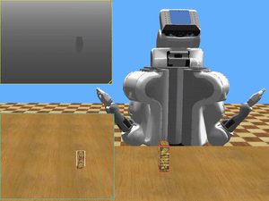
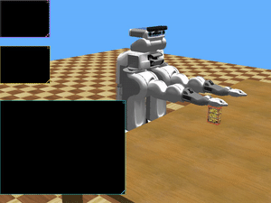
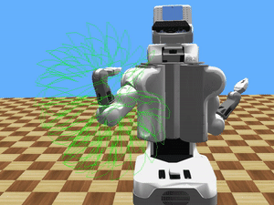
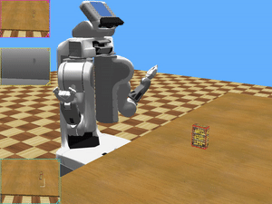
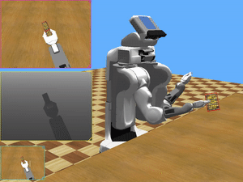
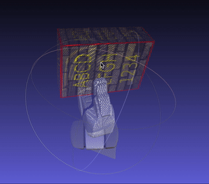
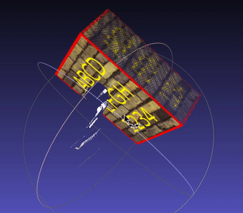

# PR2-Based Grasping and Object Geometry Reconstruction

In this project, we addressed an approach to reconstruct the geometry structure of a given object from a series of depth views using Willow Garage's PR2. We first utilize the depth camera to localize the target object that we would like to scan, then make PR2 to grasp the target object using predefined grasp planning algorithm. A set of color images as well as the depth images will be captured and aligned to reconstruct the point cloud for the target object. This report also gives simulated experiment results showing the point cloud reconstruction for the target object.

[See the slide of this project.](https://docs.google.com/presentation/d/1TUQGebvVdwsOCM7OPhNOCFZgdLJ9O2tyuxnC47piUTU/edit?usp=sharing)

## Tools and Platform
* Development Environment: macOS
* Simulator Platform: Webots
* Language: C/C++
* Robot: Willow Garage, PR2

## Target Localization
* Foreground object depth = Current depth - Background depth
* Find a 2D bounding box
* Map the center of bounding box to 3D target position

## Grasping
* Enumerate all possible arm joint parameters
* Get fingertip positions for each set of joint parameters
* Seek the nearest fingertip position to get the joint parameters

## Point Cloud Reconstrcution
* Several RGBD images will be captured
* Map the pixel in RGBDs to the point cloud
* Remove the gripper depth

## Results

## Conclusion
In this project, we addressed an approach to apply grasping on PR2 to capture a series of depth views of a target object to reconstruct its 3D geometry structure. From this project, we learned to control and manipulate robot on simulator, to implement enumeration method to get the map from arm joint parameters to fingertip positions to deploy the grasp planning, to exploit 2D depth image to calculate 3D target position, and accordingly reconstruct point cloud from it.
